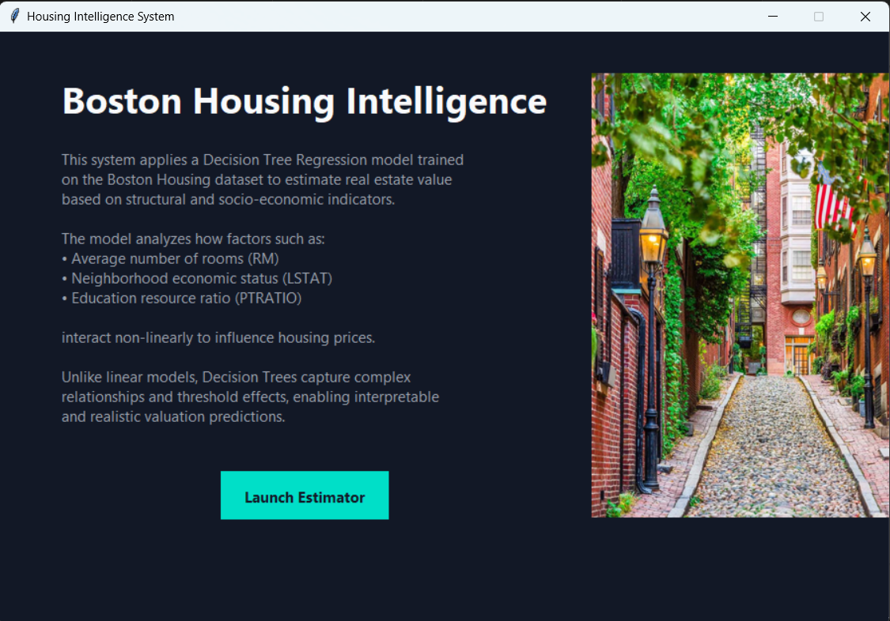
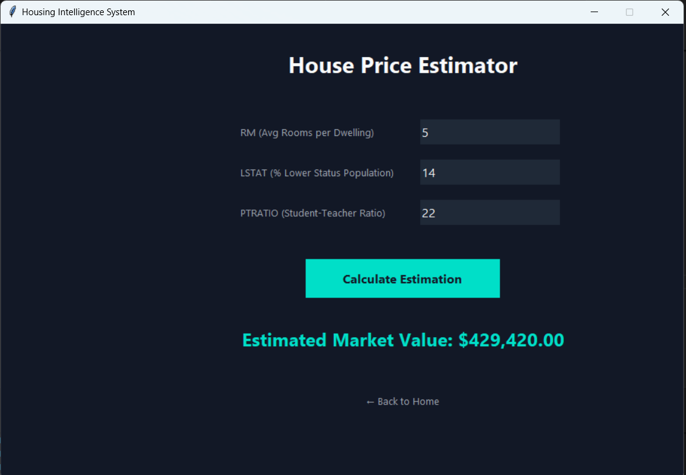

# Boston Housing Price Prediction – Task 1

## Overview
This task implements a machine learning system to predict housing prices in Boston
using a Decision Tree Regression model. The solution includes data preprocessing,
model training, and an interactive Streamlit user interface.

---

It have two pages 

### First Page
## Home

The application allows users to input housing features and obtain a predicted price.




---
### Second one
## Estimator

After entering the required values, the model generates an estimated house price.


---

## Model Details

- Model: Decision Tree Regressor
- Dataset: Boston Housing Dataset
- Features Used:
  - RM (Average number of rooms)
  - LSTAT (Lower status population %)
  - PTRATIO (Pupil–teacher ratio)

---

## How to Run

From the project root run:

```bash
streamlit run src/ML/tasks/task_1/house_prediction_ui.py